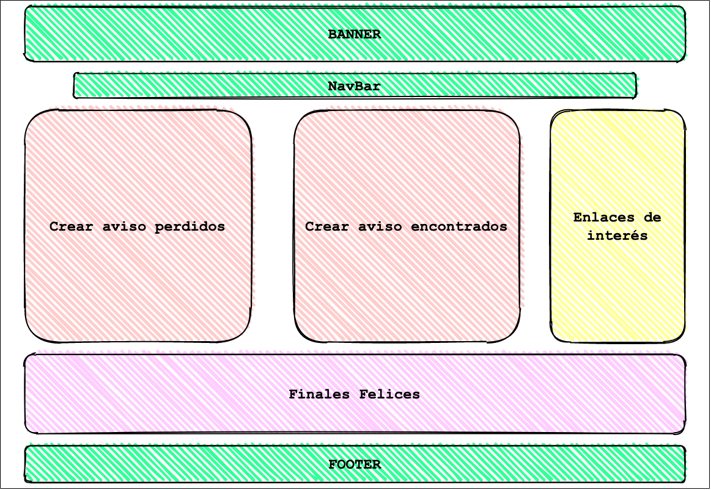
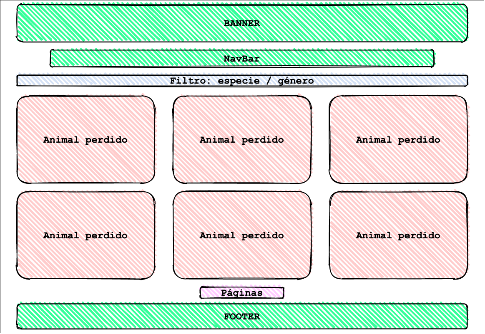

# SOS Mascotas Web v 1.0

## 1. Descripción de "SOS MASCOTAS"

SOS Mascotas consiste en una página web en la que, mediante avisos creados por los usuarios, se creará una base de datos de animales perdidos y encontrados en la Comunidad de Madrid exclusivamente, al menos en su primera versión.

Este proyecto se crea en base a la necesidad de unificar todos los avisos en un mismo lugar, especifífico para ello, con el fin de agilizar el reencuentro de los animales extraviados con sus dueños.

## 2. Descripción funcional

Los usuarios podrán interactuar de las siguientes maneras en esta página web: 
- Creando avisos de sus mascotas perdidas.
- Creando avisos de mascotas encontradas.
- Avisando a los usuarios que han creado los avisos de nueva información sobre las mascotas. En el caso de que se hayan perdido si tienen alguna información de donde pueden estar, y en el caso de que hayan sido encontradas, si conocen o son los dueños de la mascota.
- Además, una vez localizada la mascota o el dueño, podrán traspasar sus historias al apartado de "Finales Felices", donde se especificará la fecha de pérdida y la de cuándo se encontró, lo cual evitará la desmotivación de los usuarios que aun no tengan un final feliz puesto que puede pasar mucho tiempo hasta que se solucionan los avisos.
- Por último, se proporcionará la opción de, en caso de necesidad, informar al dueño del fallecimiento del animal.

La página web cuenta con 6 links sobre los que navegar:
- INICIO
- ANIMALES PERDIDOS
- ANIMALES ENCONTRADOS
- FINALES FELICES
- CONSEJOS
- CONTACTO

INICIO:
Donde podemos encontrar la funcionalidad básica de la página: crear los avisos según el caso correspondiente.
Existe también un resumen de los últimos finales felices, es decir, los últimos reencuentros.
Y unos links externos que son de utilidad para los usuarios, como: web de la policia (para realizar las denuncias correspondientes, la web del RIAC, registro de animales y un listado de las distintas protectoras de la Comunidad Autónoma con las que poder contactar por si el animal hubiese sido entregado en una de ellas).

ANIMALES PERDIDOS:
Recopilación de los avisos de animales perdidos. Estos avisos son creados mediante un formulario por parte del dueño del animal (usuario). En ellos se proporcionara la siguiente información del animal: nombre, especie, raza, color, sexo, si lleva chapa identificativa o no, las sujecciones que llevaba en el momento que se perdió (collar, arnes, correa...), se especificará si lleva chip o no, no será necesaria la numeración del mismo, el lugar (mediante un mapa) y la fecha donde se perdió y una fotografía del animal.

## Casos de uso:

## 3. Descripción técnica

A continuación se muestra un esquema de los modelos que serán la base de toda la información mostrada en la web:

## 4. Tecnologías

Para este proyecto, se han utilizado las siguientes tecnologías de desarrollo web:

- HTML: para realizar el esqueleto del proyecto.
- CSS: para que el estilo sea visualmente agradable para el usuario.
- Boostrap: como nueva herramienta para facilitar la creación de elementos y estilos.
- Vanilla JS: para darle al proyecto la funcionalidad necesaria.
- GitHub: repositorio remoto para trabajar desde distintas branches.
- API y Json: bases de datos externas que proveen la información mostrada en la web.
- MongoDB

## 5. Versiones:
v.1.0 Primera Version (26/02/21)

## To Do:

