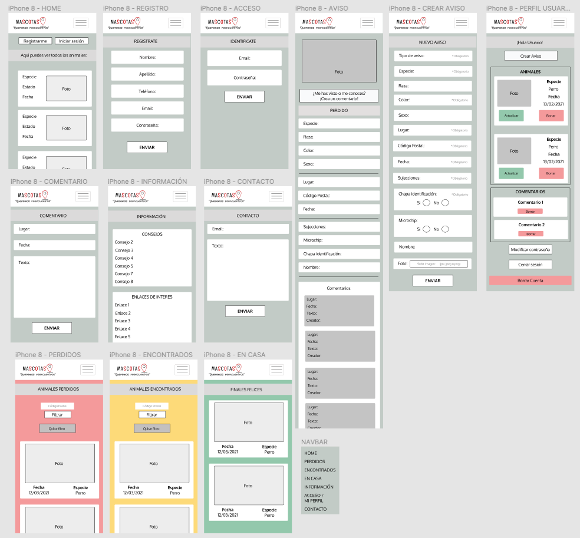
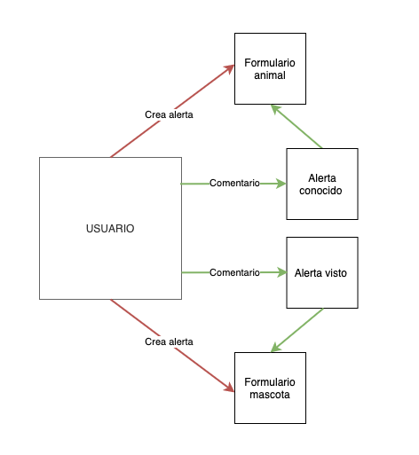
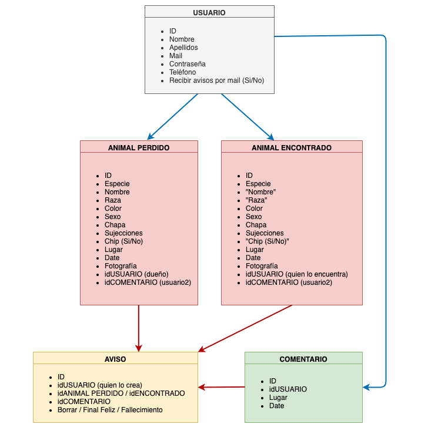

# SOS Mascotas Web v 1.0


https://sosmascotas.herokuapp.com/

## 1. Descripción de "SOS MASCOTAS"

SOS Mascotas consiste en una página web en la que, mediante avisos creados por los usuarios, se creará una base de datos de animales perdidos y encontrados en la Comunidad de Madrid exclusivamente, al menos en su primera versión.

Este proyecto se crea en base a la necesidad de unificar todos los avisos en un mismo lugar, especifífico para ello, con el fin de agilizar el reencuentro de los animales extraviados con sus dueños.

## 2. Descripción funcional

Los usuarios podrán interactuar de las siguientes maneras en esta página web: 
- Creando avisos de sus mascotas perdidas.
- Creando avisos de mascotas encontradas.
- Avisando a los usuarios que han creado los avisos de nueva información sobre las mascotas. En el caso de que se hayan perdido si tienen alguna información de donde pueden estar, y en el caso de que hayan sido encontradas, si conocen o son los dueños de la mascota.
- Además, una vez localizada la mascota o el dueño, podrán traspasar sus historias al apartado de "Finales Felices", donde se especificará la fecha de pérdida y la de cuándo se encontró, lo cual evitará la desmotivación de los usuarios que aun no tengan un final feliz puesto que puede pasar mucho tiempo hasta que se solucionan los avisos.

La barra de navegación web cuenta con 7 links sobre los que navegar:
- HOME
- ANIMALES PERDIDOS
- ANIMALES ENCONTRADOS
- FINALES FELICES
- ACCESO / MI PERFIL
- INFORMACIÓN
- CONTACTO (deshabilitado actualmente)



HOME:
Donde podemos encontrar la funcionalidad básica de la página: crear los avisos según el caso correspondiente.
Existe también un resumen de los últimos finales felices, es decir, los últimos reencuentros.
Y unos links externos que son de utilidad para los usuarios, como: web de la policia (para realizar las denuncias correspondientes, la web del RIAC, registro de animales y un listado de las distintas protectoras de la Comunidad Autónoma con las que poder contactar por si el animal hubiese sido entregado en una de ellas).

ANIMALES PERDIDOS:
Recopilación de los avisos de animales perdidos. Estos avisos son creados mediante un formulario por parte del dueño del animal (usuario). En ellos se proporcionara la siguiente información del animal: nombre, especie, raza, color, sexo, si lleva chapa identificativa o no, las sujecciones que llevaba en el momento que se perdió (collar, arnes, correa...), se especificará si lleva chip o no, no será necesaria la numeración del mismo, el lugar y la fecha donde se perdió, una fotografía del animal y el estado en el que se encuentra el aviso: "Perdido, encontrado, en casa o fallecido".

ANIMALES ENCONTRADOS:
Recopilación de los avisos de animales encontrados. Estos avisos son creados mediante un formulario por parte de la persona que se encuentra al animal (usuario). En ellos se proporcionara la siguiente información del animal: nombre (en caso de que se sepa), especie, raza, color, sexo, si lleva chapa identificativa o no, si lleva alguna sujección (collar, arnes, correa...) y chip (si se ha llevado a un veterinario a comprobar si lo tiene), no será necesaria la numeración del mismo, el lugar y la fecha donde se encontró, una fotografía del animal y el estado en el que se encuentra el aviso: "Perdido, encontrado, en casa o fallecido".

FINALES FELICES:
Recopilación de los avisos, una vez pasados al estado "EN CASA", siempre y cuando el usuario quiera, que hayan tenido un final feliz, es decir, que estén de nuevo en casa o con sus dueños.

ACCESO / MI PERFIL:
Perfil del usuario una vez registrado, donde podrá, crear, modificar y borrar sus avisos; borrar los comentarios que haya creado sobre otros animales; modificar su contraseña; cerrar sesión y borrar su cuenta.

INFORMACIÓN:
Listado de pasos a seguir en caso de que se te pierda un animal o te encuentres uno junto con listado de enlaces de interes por si te encuentras en esa situación.

CONTACTO:
Formulario para que los usuarios puedan ponerse en contacto con nosotros si tienen alguna duda del funcionamiento de la página o alguna sugerencia de mejora.


## Casos de uso:



Cualquier persona podrá registrarse en la web. Una vez realizado el registro, podrá crear avisos de animales, tanto perdidos como encontrados, modificar el estado de aquellos que haya creado y borrarlos.

Igualmente, los usuarios registrados, podrán realizar comentarios en un aviso, en caso de que hayan visto, encontrado o sepan algo de los animales perdidos, o si saben algun dato de los dueños de los animales encontrados.

Aquellos usuarios sin registro, podrán visualizar todos los avisos de los animales y comentarios relacionados con ellos, facilitando así, que si el animal puede estar por su zona, lo reconozcan rapidamente como un animal que necesita ayuda.

## 3. Descripción técnica Back-End.

A continuación se muestra un esquema de los modelos que serán la base de toda la información mostrada en la web, asi como las rutas para crear y acceder a los datos:



- USUARIO: id, nombre, apellidos, email, contraseña y teléfono.

    1. POST: /auth/signup.
        Ruta publica para registro de nuevo usuario.
    2. POST: /auth/login.
        Ruta publica para login de usuario ya registrado.
    3. GET: /users.
        Ruta publica para ver todos los usuarios.
    4. GET: /users/myprofile/:id.
        Ruta privada para ver el perfil de usuario.
    5. PUT: /users/password/:id.
        Ruta privada para realizar el cambio de contraseña.
    6. DELETE: /users/:id.
        Ruta privada para eliminar una cuenta.

- ANIMAL: id, especie, raza, nombre, color, sexo, chapa identificativa, sujecciones, chip, lugar, fecha, fotografía, estado, id del usuario que lo crea.

    1. POST: /addanimal.
        Ruta privada para la creación de avisos.
    2. GET: /animals.
        Ruta publica para ver todos los avisos de animales.
    3. GET: /animals/:id.
        Ruta publica para ver el aviso de un animal en concreto.
    4. GET: /lost.
        Ruta publica para ver todos los animales perdidos.
        Se facilita una función para filtar según el código postal.
    5. GET: /found.
        Ruta publica para ver todos los animales encontrados.
         Se facilita una función para filtar según el código postal.
    6. GET: /athome.
        Ruta publica para ver todos los animales con final feliz.
    7. GET: /cp/:cp. (finalmente sin uso, usada solo para desarrollo)
        Ruta publica para ver todos los animales según código postal.
    8. PUT: /animals/:id.
        Ruta privada para actualizar el aviso de un animal.
    9. DELETE: /animals/:id.
        Ruta privada para eliminar el aviso de un animal.

- COMENTARIO: id, id del usuario que lo crea, id del animal sobre el que se hace, cuadro de texto, fecha de creación y lugar donde ha visto al animal (no es requerido si el comentario es para añadir información sobre el animal que se pueda tener).

    1. POST: /addcomment.
        Ruta privada para la creación de comentarios.
    2. GET: /comments. (finalmente sin uso, usada solo para desarrollo)
        Ruta publica para ver todos los comentarios.
    3. GET: /comments/mycomments.
        Ruta privada para ver los comentarios de un usuario en su perfil.
    4. GET: /comments/animal/:id.
        Ruta publica para mostrar todos los comentarios que se han hecho sobre un animal en su aviso.
    5. DELETE: /comment/:id.
        Ruta privada para eliminar un comentario.


Para comprobar la autentificación del usuario contamos con un middleware que se encarga de revisar el token del mismo, dandole asi, acceso a las rutas privadas.

Por otro lado, usamos la herramienta Multer para que se puedan añadir las fotografías de los animales a la base de datos y mostrarlas posteriormente a los usuarios.

También se realizar las validaciones previas a la creación de cualquier usuario, aviso o comentario nuevo.

## 4. Descripción técnica Front-End.

A continuación se describen los componentes de la parte FrontEnd y sus utilidades:

Todas las llamadas y envíos de información desde/al back-end, se realizan mediante Axios.

- Home
    1. alertsHome.jsx:
        <br/>
        Se realiza una llamada al Back-End en la ruta ```GET: /animals``` mediante la cuál se recibe la array con todos los animales de la base de datos. 
        
        Posteriormente, mediante el método ```.map()```, creamos una pequeña vista de cada uno de ellos para mostrarlos en la página principal. 

        Se accede a el mediante la vista de ```'/'```.

    2. buttonsHome.jsx:
        <br/>
        Este componente consta unicamente de dos botones que hacen de ```Link``` directo a las vistas de ```'/registro'``` y ```'/login'``` respectivamente.

- General
    1. navBar.jsx
        <br/>
        NavBar creada con Boostrap y ```Links``` gestionados con react-router-dom.

    2. footer.jsx
        <br/>
        NavBar creada con Boostrap y fijada al pie de página mediante la clase ```'sticky-bottom'```.

- Register
    1. register.jsx
        <br/>
        Se realiza post al Back-End en la ruta ```POST: /auth/signup```, envíandole los datos previamente recogidos mediante un formulario completado por el nuevo usuario. Declaramos un ```useState({})``` inicial de objeto con keys cuyos valores están vacíos, que serán rellenados a traves del formulario.

        Además, se creará el token de acceso con ```localStorage.setItem()``` y mediante la función ```setAuthToken()``` damos acceso al usuario a todas aquellas llamadas que se realicen a traves de Axios.

        El acceso a esta vista será ```'/registro'```.

- LogIn
    1. login.jsx
        <br/>
        Del mismo modo, se realiza post al Back-End en la ruta ```POST: /auth/login```, envíandole los datos previamente recogidos mediante un formulario completado por el usuario ya registrado anteriormente. Declaramos un ```useState({})``` inicial de objeto con keys cuyos valores están vacíos, que serán rellenados a traves del formulario.

        Además, se creará el token de acceso con ```localStorage.setItem()``` y mediante la función ```setAuthToken()``` damos acceso al usuario a todas aquellas llamadas que se realicen a traves de Axios.

        El acceso a esta vista será ```'/login'```.

- Perfil
    1. userProfile.jsx
        <br/>
        Se realiza llamada al Back-End en la ruta ```GET: /users/myprofile``` solicitando la respuesta de los datos del usuario según la ID del mismo incluida en el token.

        Declaramos un ```useState({})``` inicial de objeto con keys cuyos valores están vacíos, que serán rellenados con los datos recibidos desde el servidor.

        Creamos la función ```logOut()``` a través de la cual eliminamos el token:  ```localStorage.removeItem()``` y a su vez redirigimos al usuario a la vista de ```'/login'```.

        Se realiza llamada a la ruta ```DELETE: /users/:id``` dentro de la función ```borrarCuenta()```. Con esta opción se facilita al usuario la eliminación de sus datos mediante un sencillo botón, que eliminará el token ```localStorage.removeItem()``` y le redirigira a la vista principal ```'/'```.

        El acceso a esta vista será ```'/myprofile'```.

    2. userAnimals.jsx
        <br/>
        Se realiza llamada al Back-End en la ruta ```GET: /animals/myanimals/:id``` solicitando la respuesta de los datos de los animales creados por un usuario en concreto, del cual se realizará posteriormente un ```.map()``` para visualizarlos todos.

        La respuesta será una array por lo que declaramos el ```useState([])``` que será rellenado por los animales cuya ID del usuario creador coincidan con la que se facilita a través del token.

        En este mismo componente, utilizamos también la ruta del Back-End ```DELETE: /animal/:id``` gracias a la que el usuario podrá borrar cualquiera de sus animales creados mediante la función ```deleteAnimal()``` que se llevará a cabo por parte del usuario pinchando en el botón correspondiente.

    3. userComments.jsx
        <br/>
         Se realiza llamada al Back-End en la ruta ```GET: /comments/mycomments/``` solicitando la respuesta de todos los comentarios creados por un usuario en concreto, del cual se realizará posteriormente un ```.map()``` para visualizarlos todos.

        La respuesta será una array por lo que declaramos el ```useState([])``` que será rellenado por los comentarios cuya ID del usuario creador coincidan con la que se facilita a través del token.

        En este mismo componente, utilizamos también la ruta del Back-End ```DELETE: /comment/:id``` gracias a la que el usuario podrá borrar cualquiera de sus comentarios mediante la función ```deleteComment()``` que se llevará a cabo por parte del usuario pinchando en el botón correspondiente.

    4. updateAnimal.jsx
        <br/>
        Mediante este componente y la ruta de Back-End ```PUT: /animal/:id```se accede a la posibilidad de modificar el estado del aviso que ha creado el usuario. 

        Para ello, declaramos el estado inicial mediante ```useState('')```, al cual le indicaremos el valor gracias a un ```<select>``` que contará con la función ```handleChangeStatus()``` para poder llevarse a cabo.

        Una vez finalizado el cambio, redirigimos al usuario a la vista ```'/myprofile'```.

        El acceso a esta vista será ```'/updateanimal/:id'```.

    5. userPassword.jsx
        <br/>
        Creamos la función ```handleChangePassword()``` dentro de la cual llamamos al Back-End a través de la ruta ```PUT: users/password``` y tras declarar el valor de la nueva contraseña con ```useState('')```, pedimos al usuario que indique mediante un ```<input>``` su nueva contraseña.

        Tras esto, redirimos de nuevo al usuario a su perfil con ```'/myprofile'```.

        El acceso a esta vista será ```'/password/:id'```.

- Alert Form
    1. alertForm.jsx
        <br/>
        Para este componente declaramos dos ```useState({})```, el primero con todas las key necesarias para que el Back-End pueda rellenar el modelo, el segundo será exclusivamente para poder incluir, además, una fotografía del animal (en caso de que no se haga nada, se mostrará una imagen por defecto).

        Todos los datos serán recogidos a través de un formulario y sus valores se actualizarán gracias a las funciones ```handleChangeInput()``` y ```handleChangePhoto()```.

        Creamos la funcion ```createAlert()``` dentro de la cual realizaremos la llamada al Back-End a traves de la ruta ```POST: /addanimal```, en la cual de pasará el ```formData```que contendrá los valores introducidos por el usuario.

        Se mostrará un aviso de que todo ha se ha realizado correctamente y se redigirá a la vista ```'/myprofile'```.

        El acceso a esta vista será ```'/addalert/:id'```.

- Comment
    1. comment.jsx
        <br/>
        Antes de acceder a este componente, se revisará si el usuario esta logeado mediante la funcion ```NoToken()```, en caso de no ser asi, se le redigira a la vista ```'/login'```.

        Una vez dentro, declaramos el ```useState({})``` con las key necesarias por parte del Back-End para la creación del mismo, entre ellas, la ID del animal al cual se refiere, que vendrá especificada mendiante props.

        Gestionamos los cambios de estados con la función ```handleChangeInput()``` y una vez recogidos todos los datos se llevará a cabo la función ```createComment()```. En ella llamaremos al Back-End a traves de la ruta ```POST: /addcomment``` y una vez finalizada la creación del comentario, el usuario volverá a la vista anterior mediante ```history.goBack()```.

        El acceso a esta vista será ```'/addcomment/:id'```.

- Alert
    1. alertView.jsx
        <br/>
        En este componente queremos mostrar todos los datos relativos a un animal, además de los comentarios asociados a el, por lo que declararemos, en primer lugar, para el animal un ```useState({})```como objeto y en segundo lugar, para todos los comentarios que pueda tener un ```useState([])``` como array.

        Realizaremos dos llamadas al Back-End que nos facilitaran respectivamente la información necesaria para actualizar esos ```useState()```:
        Por un lado mediante la ruta ```GET: /animals/:id```y por otro mediante la ruta ```GET: /comments/animal/:id```.

        En este mismo componente, el usuario contará con un ```<button>``` que hará de ```<Link>``` a la vista ```'/addcomment/:id'```, donde podrá crear el comentario asociado a ese animal.

        El acceso a esta vista será ```'/veranimal/:id'```.

- Status
    1. alerts.jsx
        <br/>
        Componente donde se realiza el diseño visual de los 3 siguientes. La información que se muestra es requerida mediante props.
        La renderización consiste en "tarjetas" donde se muestra la información mas básica de cada animal gracias al método ```.map()``` y que además hacen de ```<Link>``` para acceder a la vista de ```'/veranimal/:id'```.

    2. alertLost.jsx
        <br/>
        Realizamos la llamada al Back-End mediante la ruta ```GET: /lost```.
        Se declara el ```useState([])``` inicialmente vacío, que será rellenado con todos aquellos animales cuyo tipo de aviso sea ```'Perdido'```.

        Contamos con la función ```filter()``` que permitirá al usuario hacer una busqueda mediante el código postal que quiera, entrando en juego otro ```useState([])``` que será completado por aquellos animales que cumplan esa condición. Una vez se elimine el filtro con la función ```deleteFilter()``` o no haya coincidencias, se mostrata el primer ```useState([])``` con todos los animales.

        El acceso a esta vista será ```'/perdidos'```.

    3. alertFound.jsx
        <br/>
        Realizamos la llamada al Back-End mediante la ruta ```GET: /found```.
        Se declara el ```useState([])``` inicialmente vacío, que será rellenado con todos aquellos animales cuyo tipo de aviso sea ```'Encontrado'```.

        Contamos con la función ```filter()``` que permitirá al usuario hacer una busqueda mediante el código postal que quiera, entrando en juego otro ```useState([])``` que será completado por aquellos animales que cumplan esa condición. Una vez se elimine el filtro con la función ```deleteFilter()``` o no haya coincidencias, se mostrata el primer ```useState([])``` con todos los animales.

        El acceso a esta vista será ```'/encontrados'```.

    4. alertAtHome.jsx
        <br/>
        Realizamos la llamada al Back-End mediante la ruta ```GET: /athome```.
        Se declara el ```useState([])``` inicialmente vacío, que será rellenado con todos aquellos animales cuyo tipo de aviso sea ```'En casa'```.

        El acceso a esta vista será ```'/encasa'```.

- Info
    1. infoConsejos.jsx
        <br/>
        Componente en el que se muestran distintos consejos para cualquiera de las situaciones que se contemplan en esta aplicación: que se te pierda un animal o que te lo encuentres.
    2. infoLinks.jsx
        <br/>
        Para complementar lo anterior, en este componente añadimos enlaces a otras páginas webs que pueden ser de utilidad en esas situaciones.
    3. info.jsx
        <br/>
        Vista de los dos componentes anteriores a la que el usuario podrá acceder a través de ```'/info'```.

- Contact
    1. contact.jsx
        <br/>
        Deshabilitada por el momento.


## 5. Tecnologías

Para este proyecto MERN, se han utilizado las siguientes tecnologías de desarrollo web:

- HTML.
- CSS.
- Boostrap.
- Vanilla JS.
- GitHub.
- API y Json.
- Postman.
- NodeJS: npm, express, nodemon, dotenv, validator, mongoose, multer, bycript, jwt, axios, cors, concurrently.
- MongoDB.
- React.

## 6. Versiones:
v.1.0 Primera Version (26/02/21)

## To Do:

- MailAlerts
- Contacto
- Alertas internas (notificaciones)

