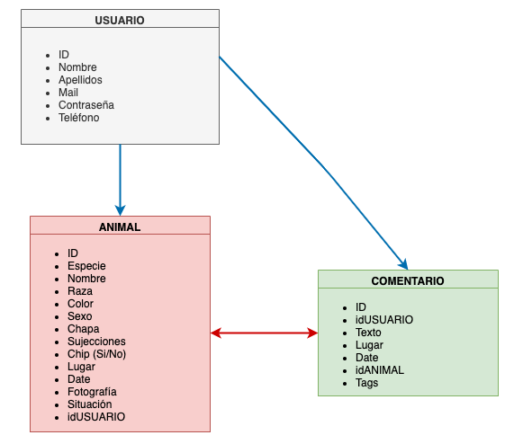

# SOS Mascotas Web v 1.0

## 1. Descripción de "SOS MASCOTAS"

SOS Mascotas consiste en una página web en la que, mediante avisos creados por los usuarios, se creará una base de datos de animales perdidos y encontrados en la Comunidad de Madrid exclusivamente, al menos en su primera versión.

Este proyecto se crea en base a la necesidad de unificar todos los avisos en un mismo lugar, especifífico para ello, con el fin de agilizar el reencuentro de los animales extraviados con sus dueños.

## 2. Descripción funcional

Los usuarios podrán interactuar de las siguientes maneras en esta página web: 
- Creando avisos de sus mascotas perdidas.
- Creando avisos de mascotas encontradas.
- Avisando a los usuarios que han creado los avisos de nueva información sobre las mascotas. En el caso de que se hayan perdido si tienen alguna información de donde pueden estar, y en el caso de que hayan sido encontradas, si conocen o son los dueños de la mascota.
- Además, una vez localizada la mascota o el dueño, podrán traspasar sus historias al apartado de "Finales Felices", donde se especificará la fecha de pérdida y la de cuándo se encontró, lo cual evitará la desmotivación de los usuarios que aun no tengan un final feliz puesto que puede pasar mucho tiempo hasta que se solucionan los avisos.
- Por último, se proporcionará la opción de, en caso de necesidad, informar al dueño del fallecimiento del animal.

La página web cuenta con 6 links sobre los que navegar:
- INICIO
- ANIMALES PERDIDOS
- ANIMALES ENCONTRADOS
- FINALES FELICES
- CONSEJOS
- CONTACTO

INICIO:
Donde podemos encontrar la funcionalidad básica de la página: crear los avisos según el caso correspondiente.
Existe también un resumen de los últimos finales felices, es decir, los últimos reencuentros.
Y unos links externos que son de utilidad para los usuarios, como: web de la policia (para realizar las denuncias correspondientes, la web del RIAC, registro de animales y un listado de las distintas protectoras de la Comunidad Autónoma con las que poder contactar por si el animal hubiese sido entregado en una de ellas).

ANIMALES PERDIDOS:
Recopilación de los avisos de animales perdidos. Estos avisos son creados mediante un formulario por parte del dueño del animal (usuario). En ellos se proporcionara la siguiente información del animal: nombre, especie, raza, color, sexo, si lleva chapa identificativa o no, las sujecciones que llevaba en el momento que se perdió (collar, arnes, correa...), se especificará si lleva chip o no, no será necesaria la numeración del mismo, el lugar y la fecha donde se perdió, una fotografía del animal y el estado en el que se encuentra el aviso: "Perdido, encontrado, en casa o fallecido".

ANIMALES ENCONTRADOS:
Recopilación de los avisos de animales encontrados. Estos avisos son creados mediante un formulario por parte de la persona que se encuentra al animal (usuario). En ellos se proporcionara la siguiente información del animal: nombre (en caso de que se sepa), especie, raza, color, sexo, si lleva chapa identificativa o no, si lleva alguna sujección (collar, arnes, correa...) y chip (si se ha llevado a un veterinario a comprobar si lo tiene), no será necesaria la numeración del mismo, el lugar y la fecha donde se encontró, una fotografía del animal y el estado en el que se encuentra el aviso: "Perdido, encontrado, en casa o fallecido".

FINALES FELICES:
Recopilación de los avisos, una vez pasados al estado "EN CASA", siempre y cuando el usuario quiera, que hayan tenido un final feliz, es decir, que estén de nuevo en casa o con sus dueños.

CONSEJOS:
Listado de pasos a seguir en caso de que se te pierda un animal o te encuentres uno.

CONTACTO:
Formulario para que los usuarios puedan ponerse en contacto con nosotros si tienen alguna duda del funcionamiento de la página o alguna sugerencia de mejora.

## Casos de uso:

Cualquier persona podrá registrarse en la web. Una vez realizado el registro, podrá crear avisos de animales, tanto perdidos como encontrados, modificar el estado de aquellos que haya creado y borrarlos.

Igualmente, los usuarios registrados, podrán realizar comentarios en un aviso, en caso de que hayan visto, encontrado o sepan algo de los animales perdidos, o si saben algun dato de los dueños de los animales encontrados.

Aquellos usuarios sin registro, podrán visualizar todos los avisos de los animales y comentarios relacionados con ellos, facilitando así, que si el animal puede estar por su zona, lo reconozcan rapidamente como un animal que necesita ayuda.

## 3. Descripción técnica

A continuación se muestra un esquema de los modelos que serán la base de toda la información mostrada en la web, asi como las rutas para crear y acceder a los datos:

- USUARIO: id, nombre, apellidos, email, contraseña y teléfono.

    1. POST: /auth/signup.
        Ruta publica para registro de nuevo usuario.
    2. POST: /auth/login.
        Ruta publica para login de usuario ya registrado.
    3. GET: /users.
        Ruta publica para ver todos los usuarios.
    4. GET: /users/myprofile/:id.
        Ruta privada para ver el perfil de usuario.
    5. PUT: /users/password/:id.
        Ruta privada para realizar el cambio de contraseña.
    6. DELETE: /users/:id.
        Ruta privada para eliminar una cuenta.

- ANIMAL: id, especie, raza, nombre, color, sexo, chapa identificativa, sujecciones, chip, lugar, fecha, fotografía, estado, id del usuario que lo crea.

    1. POST: /addanimal.
        Ruta privada para la creación de avisos.
    2. GET: /animals.
        Ruta publica para ver todos los avisos de animales.
    3. GET: /animals/:id.
        Ruta publica para ver el aviso de un animal en concreto.
    4. GET: /lost.
        Ruta publica para ver todos los animales perdidos.
    5. GET: /found.
        Ruta publica para ver todos los animales encontrados.
    6. GET: /athome.
        Ruta publica para ver todos los animales con final feliz.
    7. GET: /cp/:cp.
        Ruta publica para ver todos los animales según código postal.
    8. PUT: /animals/:id.
        Ruta privada para actualizar el aviso de un animal.
    9. DELETE: /animals/:id.
        Ruta privada para eliminar el aviso de un animal.

- COMENTARIO: id, id del usuario que lo crea, id del animal sobre el que se hace, cuadro de texto, fecha de creación, lugar donde ha visto al animal (no es requerido si el comentario es para añadir información sobre el animal que se pueda tener) y tags (para facilitar los filtros de busqueda.)

    1. POST: /addcomment.
        Ruta privada para la creación de comentarios.
    2. GET: /comments.
        Ruta publica para ver todos los comentarios.
    3. GET: /comments/:id.
        Ruta publica para ver un comentario en concreto.
    4. GET: /comments/animal/:id.
        Ruta publica para ver todos los comentarios que se han hecho sobre un animal.
    5. DELETE: /comments/:id.
        Ruta privada para eliminar un comentario.

Para comprobar la autentificación del usuario contamos con un middleware que se encarga de revisar el token del mismo, dandole asi, acceso a las rutas privadas.

Por otro lado, usamos la herramienta Multer para que se puedan añadir las fotogrfías de los animales a la base de datos y mostrarlas posteriormente a los usuarios.

También se realizar las validaciones previas a la creación de cualquier usuario, aviso o comentario nuevo.

## 4. Tecnologías

Para este proyecto, se han utilizado las siguientes tecnologías de desarrollo web:

- HTML.
- CSS.
- Boostrap.
- Vanilla JS.
- GitHub.
- API y Json.
- Postman.
- NodeJS: express, nodemon, dotenv, validator, mongoose, multer, bycript, jwt.
- MongoDB.
- React.

## 5. Versiones:
v.1.0 Primera Version (26/02/21)

## To Do:

- LogOut
- MailAlerts

